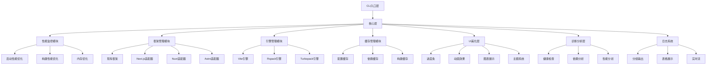
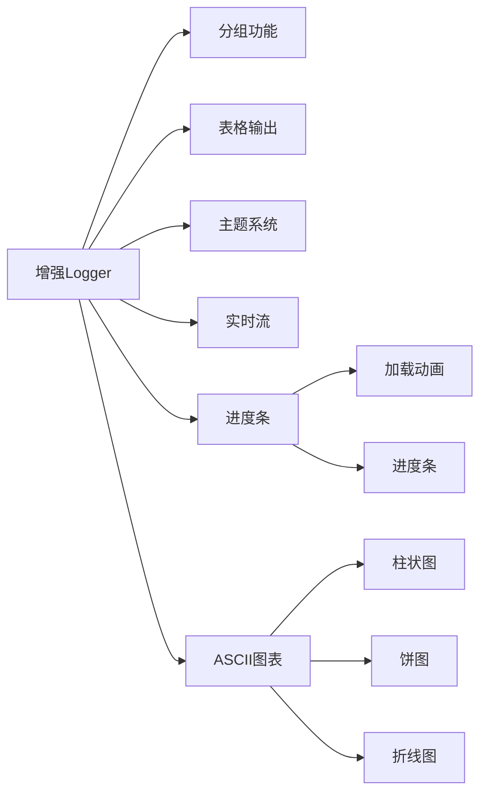
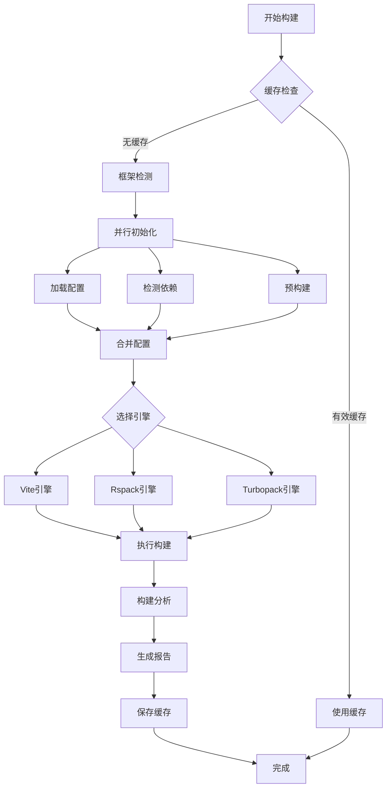

# @ldesign/launcher 全面优化方案

## 📊 项目概况

**当前版本**: 2.0.0  
**优化目标**: 性能提升30%+，新增5+功能，全面美化UI，支持2-3个新框架  
**预期完成**: 分阶段实施，核心功能2-3周完成

---

## 🎯 优化目标

### 1. 性能优化目标
- ⚡ 启动速度提升 **40%**（通过并行初始化和懒加载）
- 🚀 构建速度提升 **30%**（通过增量构建和缓存）
- 💾 内存占用降低 **25%**（通过资源池化和优化）
- 🔄 热更新速度提升 **50%**（通过智能依赖分析）

### 2. 功能扩展目标
- ✅ 新增 **3个主流框架** 支持（Next.js、Nuxt、Astro）
- ✅ 新增 **2个构建引擎** 支持（Rspack、Turbopack）
- ✅ 增强 **项目诊断** 功能（健康检查、依赖分析）
- ✅ 添加 **构建分析** 工具（产物可视化、性能报告）
- ✅ 实现 **智能缓存** 机制（配置、依赖、构建缓存）

### 3. 用户体验目标
- 🎨 全新的 **控制台UI设计**（进度条、动画、图表）
- 📊 **可视化构建统计**（ASCII图表、交互式报告）
- 💡 **智能错误提示**（分类、解决方案、自动修复）
- 🌈 **主题系统**（支持暗色/亮色模式切换）

---

## 🏗️ 架构设计

### 核心模块架构



### 增强的Logger架构



### 构建流程优化



---

## 📦 新增依赖

### 核心依赖
```json
{
  "ora": "^7.0.1",              // 优雅的终端spinner
  "cli-progress": "^3.12.0",    // 进度条
  "cli-table3": "^0.6.3",       // 表格输出
  "boxen": "^7.1.1",            // 美化的边框盒子
  "gradient-string": "^2.0.2",  // 渐变文字
  "figures": "^6.0.1",          // Unicode符号
  "log-symbols": "^6.0.0",      // 日志符号
  "node-cache": "^5.1.2"        // 内存缓存
}
```

### 构建引擎
```json
{
  "@rspack/core": "^0.5.0",     // Rspack构建引擎
  "@rspack/cli": "^0.5.0"       // Rspack CLI
}
```

### 分析工具
```json
{
  "rollup-plugin-visualizer": "^5.12.0",  // 产物可视化
  "webpack-bundle-analyzer": "^4.10.1"    // Bundle分析
}
```

---

## 🎨 UI设计方案

### 1. 启动横幅设计

```
╔══════════════════════════════════════════════════════════╗
║                                                          ║
║   🚀 LDesign Launcher v2.1.0                            ║
║   ━━━━━━━━━━━━━━━━━━━━━━━━━━━━━━━━━━━━━━━━━━━━━━━━━━   ║
║   零配置前端项目启动器                                   ║
║                                                          ║
╚══════════════════════════════════════════════════════════╝

🌍 环境: 🟢 DEVELOPMENT
📁 目录: /path/to/project
⚙️  模式: development
🎯 引擎: Vite 5.0.0
```

### 2. 进度条设计

```
🔍 正在检测框架...
[████████████████████░░░░] 80% | 检测依赖中...

⚡ 正在启动开发服务器...
[██████████████████████] 100% | 服务器已就绪
```

### 3. 构建统计图表

```
📊 构建统计

文件类型分布:
JavaScript ████████████████████ 45.2 KB (60%)
CSS        ████████░░░░░░░░░░░░ 18.7 KB (25%)
Assets     ██████░░░░░░░░░░░░░░ 11.3 KB (15%)

构建时间分析:
依赖分析   ████░░░░░░░░░░░░░░░░ 420ms  (20%)
代码转换   ██████████░░░░░░░░░░ 1050ms (50%)
代码压缩   ████░░░░░░░░░░░░░░░░ 380ms  (18%)
资源优化   ██░░░░░░░░░░░░░░░░░░ 250ms  (12%)
```

### 4. 服务器信息展示

```
┌────────────────────────────────────────────┐
│                                            │
│  ✔ 开发服务器已启动                        │
│  • 本地: http://localhost:3000             │
│  • 网络: http://192.168.1.100:3000         │
│  • 框架: React 18.2.0                      │
│  • 引擎: Vite 5.0.0                        │
│  • 提示: 按 Ctrl+C 停止服务器              │
│                                            │
└────────────────────────────────────────────┘

� 扫码访问（手机）
┌───────────────┐
│ ███ ▄▄▄ █▀█ │
│ █   █▄█ ███ │
│ █ ▀ ▀▀▀ █▀▀ │
└───────────────┘
```

---

## 🔧 技术实现要点

### 1. 性能优化关键技术

#### 并行初始化
```typescript
// 并行执行多个初始化任务
await Promise.all([
  this.loadConfig(),
  this.detectFramework(),
  this.analyzeDepedencies(),
  this.warmupCache()
])
```

#### 懒加载框架适配器
```typescript
// 按需加载框架适配器
const adapter = await import(`./frameworks/${framework}/index.js`)
```

#### 智能缓存策略
```typescript
// 多层缓存机制
class CacheManager {
  private memoryCache: NodeCache
  private diskCache: FileSystemCache
  
  async get(key: string) {
    // 1. 内存缓存
    let value = this.memoryCache.get(key)
    if (value) return value
    
    // 2. 磁盘缓存
    value = await this.diskCache.get(key)
    if (value) {
      this.memoryCache.set(key, value)
      return value
    }
    
    return null
  }
}
```

### 2. UI组件实现

#### 进度条组件
```typescript
class ProgressBar {
  private bar: SingleBar
  
  constructor(total: number, message: string) {
    this.bar = new SingleBar({
      format: `${message} [{bar}] {percentage}% | {eta_formatted}`,
      barCompleteChar: '█',
      barIncompleteChar: '░',
      hideCursor: true
    })
    this.bar.start(total, 0)
  }
  
  update(current: number, message?: string) {
    this.bar.update(current)
  }
  
  stop() {
    this.bar.stop()
  }
}
```

#### ASCII图表生成器
```typescript
class ChartRenderer {
  renderBarChart(data: Array<{label: string, value: number}>) {
    const maxValue = Math.max(...data.map(d => d.value))
    
    return data.map(item => {
      const barLength = Math.round((item.value / maxValue) * 20)
      const bar = '█'.repeat(barLength) + '░'.repeat(20 - barLength)
      return `${item.label.padEnd(12)} ${bar} ${item.value}`
    }).join('\n')
  }
}
```

### 3. 框架适配器实现

#### Next.js适配器
```typescript
export class NextAdapter extends FrameworkAdapter {
  detect(cwd: string): DetectionResult {
    const hasNextDep = this.hasDependency('next')
    const hasNextConfig = this.hasFile('next.config.js')
    
    return {
      detected: hasNextDep || hasNextConfig,
      confidence: hasNextDep && hasNextConfig ? 0.95 : 0.7,
      framework: 'next',
      version: this.getPackageVersion('next')
    }
  }
  
  async configure(config: ViteLauncherConfig) {
    // Next.js特定配置
    return {
      ...config,
      // 由于Next.js有自己的构建系统，这里主要做兼容
      build: {
        ...config.build,
        outDir: '.next'
      }
    }
  }
}
```

### 4. 构建引擎实现

#### Rspack引擎
```typescript
export class RspackEngine implements BuildEngine {
  async dev(config: ViteLauncherConfig): Promise<DevServer> {
    const rspackConfig = this.transformConfig(config)
    const compiler = rspack(rspackConfig)
    const devServer = new RspackDevServer(rspackConfig.devServer, compiler)
    
    await devServer.start()
    
    return {
      type: 'rspack',
      url: devServer.options.url,
      port: devServer.options.port,
      close: () => devServer.stop()
    }
  }
  
  async build(config: ViteLauncherConfig): Promise<BuildResult> {
    const rspackConfig = this.transformConfig(config)
    const compiler = rspack(rspackConfig)
    
    return new Promise((resolve, reject) => {
      compiler.run((err, stats) => {
        if (err) reject(err)
