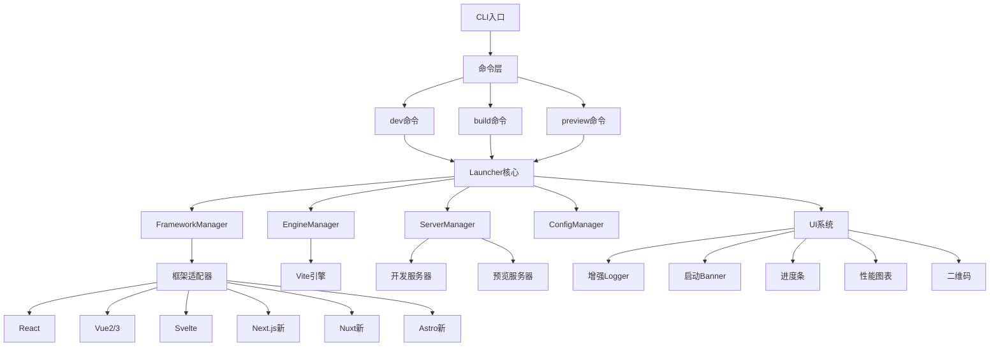

# 🚀 Launcher 项目全面优化方案

## 📋 项目概述

这是一个基于 Vite 的通用前端项目启动器,支持多种前端框架。本次优化目标是:
- ✨ 美化控制台输出
- 🎯 增强框架支持
- ⚡ 提升性能
- 🛠️ 改进开发体验

---

## 🎯 优化目标

### 1. 控制台UI美化
- 彩色、渐变的启动Banner
- 实时进度条和加载动画
- 性能指标可视化图表
- 二维码展示(本地/局域网访问)
- 网络信息展示(IP地址、端口)
- 构建统计信息美化

### 2. 框架支持扩展
- Next.js (App Router + Pages Router)
- Nuxt 3
- Astro
- Remix
- SvelteKit
- 改进现有框架适配器

### 3. 性能优化
- 优化启动速度(目标: <500ms)
- 优化构建性能(并行处理)
- 改进热更新速度
- 减少内存占用

### 4. 开发体验增强
- 智能配置预设
- 友好的错误提示
- 性能监控面板
- 自动端口分配
- 清屏和日志过滤

---

## 🏗️ 系统架构



---

## 📝 详细实现计划

### 阶段1: 控制台UI系统增强

#### 1.1 增强Logger系统
**文件**: `src/utils/logger.ts`

**功能**:
- 支持彩色输出(chalk)
- 支持emoji图标
- 日志分级(debug/info/warn/error/success)
- 日志过滤和分组
- 时间戳显示
- 支持进度回调

**实现要点**:
```typescript
// 新增功能
class Logger {
  success(message: string): void
  box(content: string): void
  table(data: Record<string, any>[]): void
  gradient(text: string, colors: string[]): void
  clearScreen(): void
  group(label: string, fn: () => void): void
}
```

#### 1.2 创建启动Banner
**文件**: `src/ui/Banner.ts`

**功能**:
- ASCII艺术字
- 渐变色彩
- 版本信息
- 框架信息
- 启动时间

**设计**:
```
╭─────────────────────────────────────────╮
│  🚀 Launcher v2.0.0                     │
│  ⚡ Lightning Fast Development Tool     │
│                                         │
│  Framework: React 18.2.0                │
│  Engine: Vite 5.0.0                     │
│  Started in: 342ms                      │
╰─────────────────────────────────────────╯
```

#### 1.3 增强进度条组件
**文件**: `src/ui/ProgressBar.ts`

**功能**:
- 多种样式(线性、圆形、百分比)
- 彩色进度条
- 子任务进度
- 预估剩余时间
- 速度显示

#### 1.4 性能图表组件
**文件**: `src/ui/Chart.ts`

**功能**:
- 柱状图(构建大小对比)
- 折线图(性能趋势)
- 饼图(资源占比)
- 表格(详细统计)

#### 1.5 二维码生成
**新文件**: `src/ui/QRCode.ts`

**功能**:
- 生成本地访问地址二维码
- 生成局域网访问地址二维码
- 终端ASCII二维码显示

---

### 阶段2: 启动流程优化

#### 2.1 优化ServerManager
**文件**: `src/core/ServerManager.ts`

**优化点**:
- 智能端口分配(检测冲突)
- 并行启动服务器
- 优化网络信息获取
- 添加服务器状态监控
- 支持HTTPS自动配置

**新增功能**:
```typescript
class ServerManager {
  // 美化的启动信息
  displayServerInfo(): void
  
  // 生成二维码
  generateQRCode(url: string): void
  
  // 显示网络信息
  displayNetworkInfo(): void
  
  // 性能监控
  monitorPerformance(): void
}
```

#### 2.2 启动信息美化
**实现位置**: `src/cli/commands/dev.ts`

**展示内容**:
```
✨ Development server started

🌐 Local:    http://localhost:3000
🌍 Network:  http://192.168.1.100:3000

📱 Scan QR code to open on mobile:
[QR Code ASCII Art]

⚡ Ready in 342ms
🎯 Press h to show help
```

---

### 阶段3: 构建流程优化

#### 3.1 优化ViteEngine
**文件**: `src/engines/vite/ViteEngine.ts`

**优化点**:
- 并行构建多个入口
- 优化依赖预构建
- 改进Tree-shaking
- 资源压缩优化
- 缓存策略优化

#### 3.2 构建信息美化
**实现位置**: `src/cli/commands/build.ts`

**展示内容**:
```
🔨 Building for production...

📦 Bundling modules...
[Progress Bar: ████████████████ 100%]

✅ Build completed in 3.2s

📊 Bundle Analysis:
┌─────────────────┬──────────┬──────────┐
│ File            │ Size     │ Gzipped  │
├─────────────────┼──────────┼──────────┤
│ index.html      │ 0.5 kB   │ 0.3 kB   │
│ assets/index.js │ 143.2 kB │ 46.8 kB  │
│ assets/index.css│ 12.4 kB  │ 3.2 kB   │
└─────────────────┴──────────┴──────────┘

Total size: 156.1 kB (gzipped: 50.3 kB)

🎉 Build successful! Ready to deploy.
```

#### 3.3 性能监控
**新文件**: `src/utils/performance-metrics.ts`

**功能**:
- 启动时间追踪
- 构建时间追踪
- 热更新时间追踪
- 内存使用监控
- 资源大小统计

---

### 阶段4: 框架支持扩展

#### 4.1 Next.js支持
**新文件**: `src/frameworks/nextjs/NextAdapter.ts`

**支持特性**:
- App Router
- Pages Router
- API Routes
- 图片优化
- 字体优化
- 服务器组件

**依赖检测**:
```typescript
{
  name: 'next',
  patterns: ['next.config.js', 'next.config.mjs', 'pages/', 'app/'],
  dependencies: ['next', 'react', 'react-dom']
}
```

#### 4.2 Nuxt支持
**新文件**: `src/frameworks/nuxt/NuxtAdapter.ts`

**支持特性**:
- Nuxt 3
- 自动导入
- 服务器路由
- 组件自动注册
- TypeScript支持

**依赖检测**:
```typescript
{
  name: 'nuxt',
  patterns: ['nuxt.config.ts', 'nuxt.config.js', 'app.vue'],
  dependencies: ['nuxt']
}
```

#### 4.3 Astro支持
**新文件**: `src/frameworks/astro/AstroAdapter.ts`

**支持特性**:
- 静态站点生成
- 服务器端渲染
- 部分水合
- 多框架集成
- 内容集合

**依赖检测**:
```typescript
{
  name: 'astro',
  patterns: ['astro.config.mjs', 'src/pages/'],
  dependencies: ['astro']
}
```

#### 4.4 Remix支持
**新文件**: `src/frameworks/remix/RemixAdapter.ts`

**支持特性**:
- 嵌套路由
- 数据加载
- 表单处理
- 错误边界

#### 4.5 SvelteKit支持
**新文件**: `src/frameworks/sveltekit/SvelteKitAdapter.ts`

**支持特性**:
- 文件路由
- 服务器端渲染
- 预渲染
- 适配器支持

---

### 阶段5: 配置管理优化

#### 5.1 增强ConfigManager
**文件**: `src/core/ConfigManager.ts`

**新增功能**:
- 配置预设系统
- 智能配置合并
- 配置验证增强
- 配置热更新
- 环境变量管理

**配置预设**:
```typescript
const presets = {
  'react-spa': { /* React单页应用配置 */ },
  'vue-spa': { /* Vue单页应用配置 */ },
  'nextjs-app': { /* Next.js应用配置 */ },
  'library': { /* 库开发配置 */ }
}
```

#### 5.2 配置验证
**文件**: `src/utils/config-validator.ts`

**增强点**:
- 更详细的错误信息
- 配置建议
- 自动修复常见问题
- 配置兼容性检查

---

### 阶段6: 错误处理增强

#### 6.1 友好错误提示
**文件**: `src/utils/error-handler.ts`

**功能**:
- 错误分类和美化
- 解决方案建议
- 相关文档链接
- 错误堆栈美化
- 错误恢复机制

**错误展示示例**:
```
❌ Build Failed

Error: Cannot find module 'react'

💡 Possible solutions:
  1. Install missing dependency: npm install react
  2. Check your package.json
  3. Clear node_modules and reinstall

📚 Documentation: https://launcher.dev/docs/troubleshooting

Stack trace:
  at requireModule (webpack.js:123)
  at buildModule (webpack.js:456)
```

---

### 阶段7: 开发体验功能

#### 7.1 网络信息展示
**新文件**: `src/utils/network-info.ts`

**功能**:
- 获取所有网络接口
- 显示本地和局域网地址
- 检测端口冲突
- 自动复制地址到剪贴板

#### 7.2 快捷键支持
**实现位置**: `src/cli/commands/dev.ts`

**快捷键**:
- `h` - 显示帮助
- `c` - 清屏
- `o` - 在浏览器中打开
- `q` - 退出
- `r` - 重启服务器

#### 7.3 清屏功能
**功能**:
- 智能清屏(保留重要信息)
- 清屏后重新显示服务器信息
- 支持日志历史

---

## 🔧 技术实现细节

### 依赖库选择

#### UI相关
```json
{
  "chalk": "^5.3.0",           // 彩色输出
  "gradient-string": "^2.0.2",  // 渐变文字
  "boxen": "^7.1.1",            // 边框盒子
  "cli-progress": "^3.12.0",    // 进度条
  "cli-table3": "^0.6.3",       // 表格
  "qrcode-terminal": "^0.12.0", // 二维码
  "ora": "^7.0.1",              // 加载动画
  "figures": "^6.0.1",          // Unicode图标
  "ansi-escapes": "^6.2.0"      // ANSI控制码
}
```

#### 性能监控
```json
{
  "perf_hooks": "内置",          // 性能钩子
  "os": "内置",                  // 系统信息
  "systeminformation": "^5.21.20" // 系统详细信息
}
```

#### 网络相关
```json
{
  "node:net": "内置",           // 网络操作
  "node:os": "内置",            // 网络接口
  "detect-port": "^1.5.1",      // 端口检测
  "clipboardy": "^4.0.0"        // 剪贴板操作
}
```

### 性能优化策略

#### 1. 启动优化
- 延迟加载非关键模块
